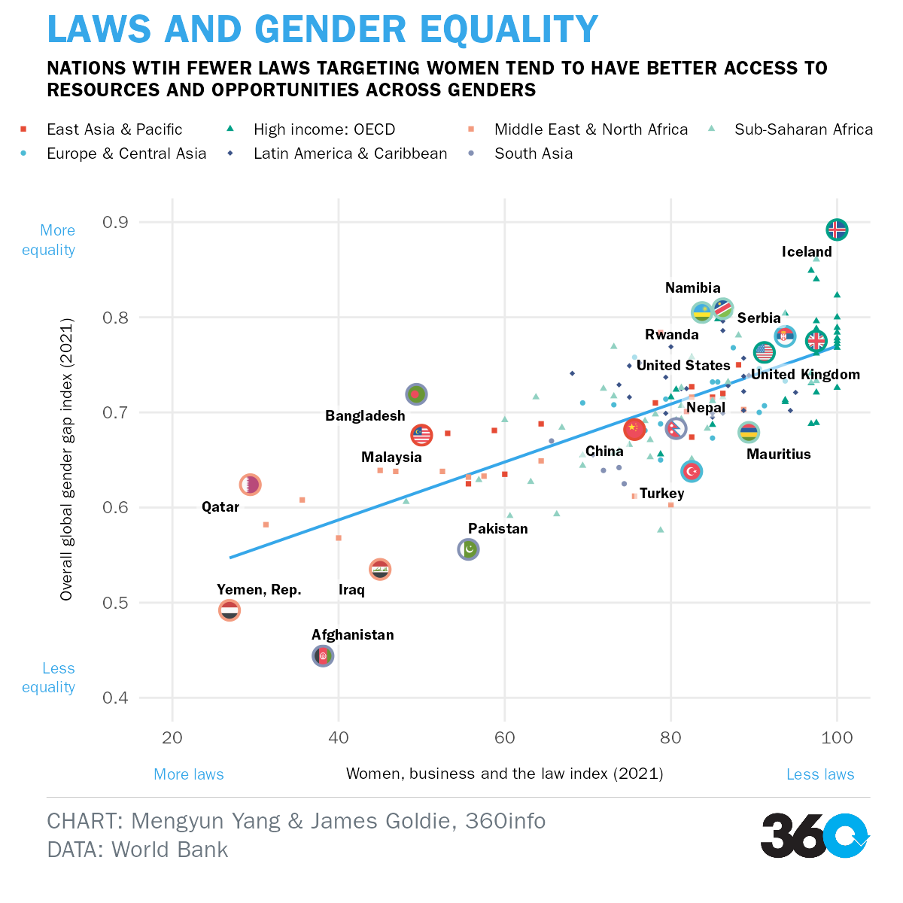

```{r setup, include=FALSE}
options(htmltools.dir.version = FALSE,
        digits = 4,
        scipen=999)
knitr::opts_chunk$set(
  # fig.width=9, 
  # fig.height=3.5, 
  # fig.retina=3,
  out.width = "100%",
  cache = FALSE,
  echo = FALSE,
  message = FALSE, 
  warning = FALSE,
  hiline = TRUE
)
```

```{r xaringan-themer, include=FALSE, warning=FALSE}
library(xaringanthemer)
library(xaringanExtra)
style_duo_accent(
  primary_color = "#f8a79b",
  secondary_color = "#1b5869",
  inverse_header_color = "#FFFFFF",
  header_font_google = google_font("Josefin Sans"),
  text_font_google   = google_font("Montserrat", "300", "300i"),
  code_font_google   = google_font("Fira Mono")
)
```

background-image: url("image/collage.png")
background-size: background
background-position: right


```{css}
@import url('https://fonts.googleapis.com/css2?family=Josefin+Sans:wght@700&display=swap');


.title {
  font-family: 'Josefin Sans', sans-serif;
  font-size:60px;
  line-height: 1.3;
  padding: 15px 0;
  font-weight: 800;
  display:inline-block;
  color: #1b5869
}

.title2 {
  font-family: 'Josefin Sans', sans-serif;
  font-size:100px;
  font-weight: 800;
  color: #fcd7cb
}

.bottom {
  font-family: 'Josefin Sans';
  font-size:20px;
  position:absolute;
  bottom:33px;
  left: 50px;
  color: #1b5869;
}

.text-pink{
color: #f8a79b;
font-weight:bold
}

a, a > code {
color: #f8a79b;
font-weight:bold
}

.box-peach {
  width: 100%;
  border-radius: 25px;
  padding: 1px 1px 1px 1px;
  margin: 0;
  background-color: #fcd7cb;
}

h1 {
  color: #1b5869;
}

h4 {
  color: #1b5869;
}

ul {
  margin: 20px;
}

.remark-slide-number {
  display: none;
}

.footnote {
  font-size: 10px;
  bottom: 2em;
}
```

```{r xaringan-animate-css, echo=FALSE}
xaringanExtra::use_animate_css()
xaringanExtra::use_panelset()

```

```{r packages, include = FALSE, echo = FALSE, message = FALSE, warning = FALSE}
library(tidyverse)
library(tidytext)
library(hrbrthemes)
library(skimr)
library(janitor)
library(glue)
library(ggplot2); ggplot2::theme_set(theme_minimal())
library(ggsci)
library(here)
library(readxl)
library(stringr)
library(scales)
library(forcats)
library(plotly)
library(tmap)
library(sf)
library(leaflet)
library(shiny)
library(ggthemes)
library(kableExtra)
# library(gt)
# library(ggpubr)
library(ggflags)
library(countrycode)
library(themes360info)
library(grid)
library(rsvg)
library(ggrepel)
library(patchwork)
```


```{r wbl}
# downloaded from https://wbl.worldbank.org/en/wbl-data
wbl_df <- read_xlsx(here("data/WBL1971-2022 Dataset.xlsx"), sheet = 2) 

# cleaning 
wbl_df <- clean_names(wbl_df) 

# WBL indicators
wbl_mob <- read_xlsx(here("data/WBL1971-2022 Dataset.xlsx"), sheet = 3) 
wbl_mob  <- clean_names(wbl_mob) 

wbl_work <- read_xlsx(here("data/WBL1971-2022 Dataset.xlsx"), sheet = 4) 
wbl_work  <- clean_names(wbl_work) 

wbl_pay <- read_xlsx(here("data/WBL1971-2022 Dataset.xlsx"), sheet = 5) 
wbl_pay  <- clean_names(wbl_pay) 

wbl_marriage <- read_xlsx(here("data/WBL1971-2022 Dataset.xlsx"), sheet = 6) 
wbl_marriage  <- clean_names(wbl_marriage) 

wbl_parenth <- read_xlsx(here("data/WBL1971-2022 Dataset.xlsx"), sheet = 7) 
wbl_parenth  <- clean_names(wbl_parenth) 

wbl_entrep <- read_xlsx(here("data/WBL1971-2022 Dataset.xlsx"), sheet = 8) 
wbl_entrep <- clean_names(wbl_entrep) 

wbl_assets <- read_xlsx(here("data/WBL1971-2022 Dataset.xlsx"), sheet = 9) 
wbl_assets  <- clean_names(wbl_assets) 

wbl_pension <- read_xlsx(here("data/WBL1971-2022 Dataset.xlsx"), sheet = 10) 
wbl_pension  <- clean_names(wbl_pension) 

```

```{r gender}
# downloaded from https://data.worldbank.org/topic/gender
## skip the first 4 rows
gender <- read.csv(here("data/API_17_DS2_en_csv_v2_4040307/API_17_DS2_en_csv_v2_4040307.csv"), skip = 4)

#cleaning 
gender <- clean_names(gender) %>% 
  select(-x)

for (col in 1:ncol(gender)) {
    colnames(gender)[col] <-  sub("^x", "", colnames(gender)[col])
}
  

```

```{r gender-gap-index}
# downloaded from: https://tcdata360.worldbank.org/indicators/af52ebe9?country=BRA&indicator=27959&viz=line_chart&years=2006,2021
gap <- read_csv(here("data/gender_gap_index.csv"))

# cleaning 
gap <- clean_names(gap) 

names(gap) <- sub("x", "", names(gap))

```

```{r vdem}
# downloaded from https://www.v-dem.net/vdemds.html
vdem <- readRDS(here("data/V-Dem-CY-Full+Others-v11.1.rds"))

```


.title[The Journey <br>towards Women's <br><span style="background-color: #fcd7cb">Legal</span> <br> <span style="background-color: #fcd7cb">Empowerment</span>]


.bottom[
Presented by: Mengyun Yang
]

???
Image credit: [FineActs](https://fineacts.co/theammo/womens-rights/empowerment)


---
class: animated, rotateInDownLeft

# Agenda

#### Introduction

.box-peach[
- Background
- Data sources
]

#### Discussion

.box-peach[
- xxxxxx
- xxxxxx
- xxxxxx

]

#### Conclusion

.box-peach[
- xxxxxxxx
- xxxxxx
- xxxxxx
]


---
class: animated, rotateInDownLeft

# Introduction

.panelset[

  .panel[.panel-name[Background]
- Progress on women's rights has been .text-pink[uneven] and .text-pink[slow].

- Worldwide gender gap will not close for another 100 years.

- Women have fewer access to resources and opportunities and are under-represented in decision-making at all levels.

- Over the last decades, .text-pink[131] countries have added .text-pink[274] gender-related reforms to their laws and regulations.

- More than .text-pink[2.5 billion] women and girls are still live in countries with at least on discriminatory stature.

- This project uses descriptive analysis to identify the progress made on reducing bias in the creation of laws which can disadvantage women between 1971 to 2021.

  ]

  .panel[.panel-name[Data sources]

- [World Bank](https://wbl.worldbank.org/en/wbl-data) - The Women, Business and the law index

- [World Bank](https://tcdata360.worldbank.org/indicators/af52ebe9?country=BRA&indicator=27959&viz=line_chart&years=2006,2021) - Overall global gender gap index

- [World Bank](https://data.worldbank.org/topic/gender) - Gender indicators

- [V-Dem](https://www.v-dem.net/vdemds.html) - Democracy indicators
  ]

]


---

class: inverse, middle, center, animated, fadeIn
layout: false

.title2[Discusstion]

---

class: animated, rotateInDownLeft

## Overview of The Women, Business and the Law index


.footnote[Source: World Bank]

.panelset[

  .panel[.panel-name[The trend of WBL index]

.pull-left[
💡 Overall, there has been continuous progress being made on the laws that help improve women's legal rights.

💡 Over the 5 decades, the global average WBL index has increased substantially, from 45.6 to 76.

💡 However, the progress has varied across regions.
]

.pull-right[
```{r wbl-average}

wbl_average <- wbl_df %>% 
  filter(report_year < 2022) %>% 
  select(region, 
         report_year, 
         wbl_index) %>% 
  group_by(region,
           report_year) %>% 
  summarise(wbl = mean(wbl_index)) %>% 
  ungroup() 
  
wbl_world <- wbl_df %>% 
  filter(report_year < 2022) %>% 
  select(report_year, 
         wbl_index) %>% 
  group_by(report_year) %>% 
  summarise(wbl = mean(wbl_index)) %>% 
  ungroup() 
  

wbl_average$tooltip <- 
  glue_data(wbl_average,
            "Region: {region}",
            "Year: {report_year}",
            "\nWBL index: {round(wbl, 1)}")

wbl_world$tooltip <- 
  glue_data(wbl_world,
            "Year: {report_year}",
            "\nGlobal Average WBL index: {round(wbl, 1)}")


ggplotly(
  
wbl_average %>% 
  ggplot(aes(x = report_year,
             y = wbl)) + 
  geom_line(aes(color = region,
                group = region,
                text = tooltip),
            size = 0.8) +
  geom_point(aes(color = region,
                 text = tooltip),
             size = 1) +
  geom_line(data = wbl_world,
            aes(x = report_year,
                y = wbl,
                group = 1,
                text = tooltip,
                color = "WBL World"),
            size = 0.8) +
  geom_point(data = wbl_world,
             aes(x = report_year,
                 y = wbl,
                 text = tooltip,
                 color = "WBL World"),
             size = 1) +
  scale_color_npg(alpha = 0.8) +
  scale_x_continuous(breaks = seq(1971, 2021, by =10)) +
  theme(legend.text = element_text(size = 6)) +
  labs(x = NULL,
       y = "WBL index",
       color = NULL),
tooltip = "text",
         width = 550,
         height = 430

) %>% 
    layout(legend = list(orientation = "h")) %>% 
  config(displayModeBar = FALSE,
         displaylogo = FALSE)
```

]
  ]


  .panel[.panel-name[Laws and gender equality]
  
  .pull-left[
💡 Nations with fewer laws targeting women tend to have better access to resources and opportunities across genders.

💡 Most of the OECD high income countries have less laws against women.

💡 Namibia and Rwanda from Sub-Saharan Africa have made incredible progress.

💡 Middle East and North Africa have more discriminatory laws.
]

.pull-right[

```{r, out.height = "420px", out.width="480px"}

```
 ] 
  

  ]

]


---
class: animated, rotateInDownLeft

## Law reforms enacted by region

.footnote[Source: World Bank]

.panelset[

  .panel[.panel-name[Total reforms recorded between 1971 and 2021]

.pull-left[
💡 Sub-Saharan Africa, OECD High-income countries and Latin America and Caribbean reformed the most.

💡 Only 40 reforms were made in South Asia.
]

.pull-right[
```{r}
## calculate total reforms for each indicator by region
# mobility reforms
wbl_mob1 <- wbl_mob %>%
  filter(report_year < 2022) %>% 
  select(region,
         report_year,
         starts_with("score")) %>% 
  pivot_longer(3:6,
               names_to = "score",
               values_to = "value") %>% 
  filter(value == 0) %>%
  group_by(region, report_year) %>% 
  summarise(count = n()) %>% 
  ungroup() 


wbl_mob2 <- wbl_mob1 %>% 
  group_by(region) %>% 
  summarise(mobility_count = n_distinct(count) - 1)

# workplace reforms
wbl_work1 <- wbl_work %>% 
  filter(report_year < 2022) %>% 
  select(region,
         report_year,
         starts_with("score")) %>% 
  pivot_longer(3:6,
               names_to = "score",
               values_to = "value") %>% 
  filter(value == 0) %>%
  group_by(region, report_year) %>% 
  summarise(count = n()) %>% 
  ungroup() 


wbl_work2 <- wbl_work1 %>% 
  group_by(region) %>% 
  summarise(workplace_count = n_distinct(count) - 1)

# pay reforms
wbl_pay1 <- wbl_pay %>% 
  filter(report_year < 2022) %>% 
  select(region,
         report_year,
         starts_with("score")) %>% 
  pivot_longer(3:6,
               names_to = "score",
               values_to = "value") %>% 
  filter(value == 0) %>%
  group_by(region, report_year) %>% 
  summarise(count = n()) %>% 
  ungroup() 


wbl_pay2 <- wbl_pay1 %>% 
  group_by(region) %>% 
  summarise(pay_count = n_distinct(count) - 1)


# marriage reforms
wbl_marriage1 <- wbl_marriage %>% 
  filter(report_year < 2022) %>% 
  select(region,
         report_year,
         starts_with("score")) %>% 
  pivot_longer(3:6,
               names_to = "score",
               values_to = "value") %>% 
  filter(value == 0) %>%
  group_by(region, report_year) %>% 
  summarise(count = n()) %>% 
  ungroup() 


wbl_marriage2 <- wbl_marriage1 %>% 
  group_by(region) %>% 
  summarise(marriage_count = n_distinct(count) - 1)


# parenthood reforms
wbl_parenth1 <- wbl_parenth %>% 
  filter(report_year < 2022) %>% 
  select(region,
         report_year,
         starts_with("score")) %>% 
  pivot_longer(3:6,
               names_to = "score",
               values_to = "value") %>% 
  filter(value == 0) %>%
  group_by(region, report_year) %>% 
  summarise(count = n()) %>% 
  ungroup() 


wbl_parenth2 <- wbl_parenth1 %>% 
  group_by(region) %>% 
  summarise(parenthood_count = n_distinct(count) - 1)

# entrepreneurship reforms
wbl_entrep1 <- wbl_entrep %>% 
  filter(report_year < 2022) %>% 
  select(region,
         report_year,
         starts_with("score")) %>% 
  pivot_longer(3:6,
               names_to = "score",
               values_to = "value") %>% 
  filter(value == 0) %>%
  group_by(region, report_year) %>% 
  summarise(count = n()) %>% 
  ungroup() 


wbl_entrep2 <- wbl_entrep1 %>% 
  group_by(region) %>% 
  summarise(entrepreneurship_count = n_distinct(count) - 1)


# assets reforms
wbl_assets1 <- wbl_assets %>% 
  filter(report_year < 2022) %>% 
  select(region,
         report_year,
         starts_with("score")) %>% 
  pivot_longer(3:6,
               names_to = "score",
               values_to = "value") %>% 
  filter(value == 0) %>%
  group_by(region, report_year) %>% 
  summarise(count = n()) %>% 
  ungroup() 


wbl_assets2 <- wbl_assets1 %>% 
  group_by(region) %>% 
  summarise(assets_count = n_distinct(count) - 1)


# pension reforms
wbl_pension1 <- wbl_pension %>% 
  filter(report_year < 2022) %>% 
  select(region,
         report_year,
         starts_with("score")) %>% 
  pivot_longer(3:6,
               names_to = "score",
               values_to = "value") %>% 
  filter(value == 0) %>%
  group_by(region, report_year) %>% 
  summarise(count = n()) %>% 
  ungroup() 


wbl_pension2 <- wbl_pension1 %>% 
  group_by(region) %>% 
  summarise(pension_count = n_distinct(count) - 1)

```

```{r, fig.width=10, fig.height = 8}
# join all indicators' reforms count and plot it
wbl_mob2_plot <- wbl_mob2 %>% 
  left_join(wbl_work2, 
            by = "region") %>% 
  left_join(wbl_pay2,
            by = "region") %>% 
  left_join(wbl_marriage2,
            by = "region") %>% 
  left_join(wbl_parenth2,
            by = "region") %>% 
  left_join(wbl_entrep2,
            by = "region") %>% 
  left_join(wbl_assets2,
            by = "region") %>% 
  left_join(wbl_pension2,
            by = "region") %>% 
  pivot_longer(2:9,
               names_to = "indicator",
               values_to = "count"
               ) %>%
  group_by(region) %>% 
  summarise(total_reforms = sum(count, na.rm = TRUE)) %>% 
  mutate(region = fct_reorder(region, total_reforms))


wbl_mob2_plot %>% 
  ggplot() +
  geom_col(aes(x = region,
               y = total_reforms),
           fill = "#f39b7fff") +
  geom_text(aes(x = region,
               y = total_reforms,
               label = total_reforms,
                fill = NULL,
                hjust = 1.5),
            size = 3,
            colour = "white") +
  coord_flip() +
  # scale_fill_brewer(palette = "Paired") +
  theme(plot.caption = element_text(hjust = 0)) +
  labs(x = NULL,
       y = "Number of reforms",
       fill = NULL)
  
  
  
```

]
  ]


  .panel[.panel-name[Total reforms by indicators]
  
  .pull-left[
💡 Reforms varies across different regions and indicators.

💡 Majority of law reforms were made in the areas of workplace, pay protections and regulations affecting working parents.

💡 Sub-Saharan had the most reforms in most of the areas, except for parenthood and pay.
]

.pull-right[

```{r, fig.width=10, fig.height = 8}
wbl_mob2 %>% 
  left_join(wbl_work2,
            by = "region") %>% 
  left_join(wbl_pay2,
            by = "region") %>% 
  left_join(wbl_marriage2,
            by = "region") %>% 
  left_join(wbl_parenth2,
            by = "region") %>% 
  left_join(wbl_entrep2,
            by = "region") %>% 
  left_join(wbl_assets2,
            by = "region") %>% 
  left_join(wbl_pension2,
            by = "region") %>% 
  pivot_longer(2:9,
               names_to = "indicator",
               values_to = "count"
               ) %>%
  mutate(indicator = str_remove(indicator, "\\_count"),
         count = replace_na(count, 0)) %>% 
  # filter(region %in% c("Latin America & Caribbean",
  #                      "High income: OECD",
  #                      "Sub-Saharan Africa")) %>% 
  mutate(region = reorder_within(region, count, indicator)) %>% 
  ungroup() %>% 
  ggplot(aes(x = region,
             y = count,
             fill = indicator)) +
  geom_col() +
  geom_text(aes(x = region,
                y = count,
                label = count, 
                fill = NULL, 
                hjust = 1.5),
            size = 3,
            colour = "white") +  
  facet_wrap(vars(indicator),
             scale = "free_y") +
  coord_flip() +
  scale_x_reordered() +
  scale_fill_npg(alpha = 0.8) +
  theme(legend.position = "none",
        axis.text.y = element_text(size = 8),
        strip.text.x = element_text(size = 14),
        plot.caption = element_text(hjust = 0),
        plot.title = element_text(size = 16)) +
  labs(x = NULL,
       y = "Number of reforms")
```
 ] 
  

  ]

]


---
class: animated, bounceInDown

# 📌 Conclusion

- xxxxxx

- xxxxxxxx

- xxxxxxx


---
class: animated, fadeIn

<center></center>


.pull-left[
#### Slides are created using the following R packages:

[xaringan](https://github.com/yihui/xaringan)<br>
[gadenbuie/xaringanthemer](https://github.com/gadenbuie/xaringanthemer)<br>
[xaringanExtra](https://github.com/gadenbuie/xaringanExtra/)<br>
[tidyverse](https://www.tidyverse.org/)<br>
[plotly](https://www.rdocumentation.org/packages/plotly/versions/4.5.2)<br>
[hrbrthemes](http://github.com/hrbrmstr/hrbrthemes)<br>
[sf](https://www.rdocumentation.org/packages/sf/versions/0.1-1)<br>
[scales](https://CRAN.R-project.org/package=scales)<br>
[leaflet](https://CRAN.R-project.org/package=leaflet)

]

.pull-right[

#### Data sources: 

[Victorian COVID-19 data](https://www.coronavirus.vic.gov.au/victorian-coronavirus-covid-19-data) <br> 
[Local Government Area Boundaries (Road) (polygon) - Vicmap Admin](https://datashare.maps.vic.gov.au/search?q=bc822a9c-3766-57ac-a034-bcad3fb66d86)<br>
[Australian COVID-19 data](https://github.com/M3IT/COVID-19_Data) <br>
[Victoria unknown cases data](https://www.covid19data.com.au/)<br>
[Australia COVID-19 data - GitHub](https://github.com/M3IT/COVID-19_Data)<br>
[Weekly COVID-19 vaccine data](https://www.coronavirus.vic.gov.au/weekly-covid-19-vaccine-data)

]


---
class: middle, animated, rotateInDownLeft

<center></center>

