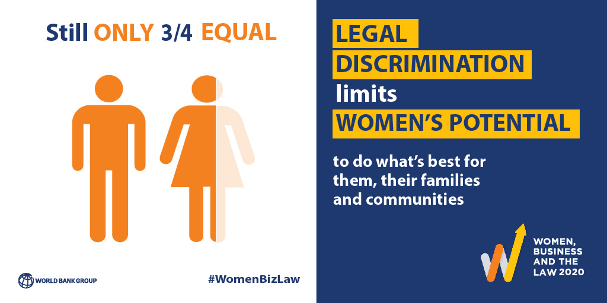

```{r setup, include = FALSE, echo = FALSE, message = FALSE, warning = FALSE}
knitr::opts_chunk$set(
  echo = FALSE,
  message = FALSE,
  warning = FALSE,
  error = FALSE, 
  collapse = TRUE,
  comment = "#",
  # fig.height = 4,
  # fig.width = 8,
  fig.align = "center",
  cache = FALSE
  )
```

```{r packages, include = FALSE, echo = FALSE, message = FALSE, warning = FALSE}
library(tidyverse)
library(tidytext)
library(skimr)
library(janitor)
library(glue)
library(ggplot2); ggplot2::theme_set(theme_minimal())
library(ggsci)
library(here)
library(readxl)
library(stringr)
library(scales)
library(forcats)
library(plotly)
library(tmap)
library(sf)
library(leaflet)
library(shiny)
library(ggthemes)
library(kableExtra)
library(gt)
library(ggpubr)
library(ggflags)
library(countrycode)
library(themes360info)
library(grid)
library(rsvg)
library(ggrepel)
library(patchwork)
```


```{r wbl}
# downloaded from https://wbl.worldbank.org/en/wbl-data
wbl_df <- read_xlsx(here("data/WBL1971-2022 Dataset.xlsx"), sheet = 2) 

# cleaning 
wbl_df <- clean_names(wbl_df) 

# WBL indicators
wbl_mob <- read_xlsx(here("data/WBL1971-2022 Dataset.xlsx"), sheet = 3) 
wbl_mob  <- clean_names(wbl_mob) 

wbl_work <- read_xlsx(here("data/WBL1971-2022 Dataset.xlsx"), sheet = 4) 
wbl_work  <- clean_names(wbl_work) 

wbl_pay <- read_xlsx(here("data/WBL1971-2022 Dataset.xlsx"), sheet = 5) 
wbl_pay  <- clean_names(wbl_pay) 

wbl_marriage <- read_xlsx(here("data/WBL1971-2022 Dataset.xlsx"), sheet = 6) 
wbl_marriage  <- clean_names(wbl_marriage) 

wbl_parenth <- read_xlsx(here("data/WBL1971-2022 Dataset.xlsx"), sheet = 7) 
wbl_parenth  <- clean_names(wbl_parenth) 

wbl_entrep <- read_xlsx(here("data/WBL1971-2022 Dataset.xlsx"), sheet = 8) 
wbl_entrep <- clean_names(wbl_entrep) 

wbl_assets <- read_xlsx(here("data/WBL1971-2022 Dataset.xlsx"), sheet = 9) 
wbl_assets  <- clean_names(wbl_assets) 

wbl_pension <- read_xlsx(here("data/WBL1971-2022 Dataset.xlsx"), sheet = 10) 
wbl_pension  <- clean_names(wbl_pension) 

```

```{r gender}
# downloaded from https://data.worldbank.org/topic/gender
## skip the first 4 rows
gender <- read.csv(here("data/API_17_DS2_en_csv_v2_4040307/API_17_DS2_en_csv_v2_4040307.csv"), skip = 4)

#cleaning 
gender <- clean_names(gender) %>% 
  select(-x)

for (col in 1:ncol(gender)) {
    colnames(gender)[col] <-  sub("^x", "", colnames(gender)[col])
}
  

```

```{r gender-gap-index}
# downloaded from: https://tcdata360.worldbank.org/indicators/af52ebe9?country=BRA&indicator=27959&viz=line_chart&years=2006,2021
gap <- read_csv(here("data/gender_gap_index.csv"))

# cleaning 
gap <- clean_names(gap) 

names(gap) <- sub("x", "", names(gap))

```

```{r vdem}
# downloaded from https://www.v-dem.net/vdemds.html
vdem <- readRDS(here("data/V-Dem-CY-Full+Others-v11.1.rds"))

```

<!--  -->
# Abstract

Despite the fact that women's economic participation has increased significantly in recent decades, women continue to be underrepresented in many areas. This project analyses whether gender differences are reflected in gendered laws that affect women's access to resources, their activities, and the constraints they face. Data used for this project are from open data sources World Bank and V-Dem. To investigating the relationship between gendred laws and women's economic participation between 1997 to 2021, firstly, an overview of the women, business and law index was conducted to give a clear picature of the progress was made in terms of reforms to a achieve more gender equal laws across 8 indicators, different regions and at country level. Although the improvement is noticeble, there is still room to imporve. Next, analysis was done on the number of law reforms enacted across regions over the years. Most reforms were made in areas of workplace, pay protections and regulations affecting working parents and regions like Sub-Saharan Africa enacted more laws in addressing women's rights over the years. Furthermore, by combining the women, business and the law index and the gender gap index and modeling with a regression model, it shows a positive associatioin between laws and gender equality. Nations with fewer laws targeting women (more gender equal laws) tend to also have better access to resources and opportunities across genders. Finally, a drill-down analysis on the 8 indicators, mobility, workplace, pay, marriage, parenthood, entrepreneuship, assets and pension by exploring the improvement made on the laws that target these specifc areas shows that there are still countries that have unjustifiable lasw that are holding women back in every aspect of their life.


# Background
For the past 47 years, International Women's Day has been celebrated worldwide on the 8th of March. It honours women's social, economic, cultural, and political achievements. The day also serves as a rallying cry for greater gender equality. Although the past decades have been significant progress for women's and girls' rights. Overall, though, progress has been uneven and slow. The worldwide gender gap will not close for another 100 years at the current rate of progress [@UnitedNations]. This analysis aims to identify the bias in the creation of laws which can disadvantage women - both socially and economically.


# Objectives 


# Methodology


# Data sources

The data used in this project consists of 4 separate data set. The women, business and the law data, gender gap index data and gender indicator data were all obtained from open data source The World Bank Data's [Women, Business and the Law Data Portal](https://wbl.worldbank.org/en/wbl-data), [Overall Global Gender Gap Index Portal](https://tcdata360.worldbank.org/indicators/af52ebe9?country=BRA&indicator=27959&viz=line_chart&years=2006,2021) and [Gender Portal](https://data.worldbank.org/topic/gender) respectively. The democracy ratings data is also an open data that sourced from [V-Dem (Varieties of Democracy by University of Gothenburg)](https://www.v-dem.net/vdemds.html).

## The women, business and the law index
The women, business and the law data set contains 10 sheets of data. It assesses the economic empowerment of women. It is based on the countries' formal laws and regulations that have a bearing on women's economic participation, covering eight areas such as mobility, workplace, pay, marriage, parenthood, entrepreneurship, assets and pension. It tracks how laws affect women at different stages in their working lives and focusing on those laws applicable in the main business city [@civilsdaily]. The first two sheets are overall WBL index scores, individual indicator scores go evaluate 35 parts of the law from 190 economies from years 1971 to 2021. The subsequent sheets present answer for the scored questions by 8 indicators. Indicator-level scores are obtained by calculating the unweighed average of the questions within that indicator and scaling the result to 100. Overall scores are then calculated by taking the average of each indicator, with 100 representing the highest possible score, a higher score suggests that there are more laws promoting gender equality [@WBL] (see Table \@ref(tab:wbl-data) for scoring method for WBL data). There are no missing values presented in this data set.

```{r wbl-data}
tribble(
  ~Score, ~Range,
  "WBL Index",   "0 - 100",
  "Indicator Score",   "0 - 100",
  "Answer to Scored Question",    "Yes/No",
  "Answer Score", "1(Yes)/0(No)"
) %>% 
  kable(caption = "Scoring method for WBL data") %>% 
  kable_styling(full_width = FALSE) %>% 
  footnote(general = "The World Bank",
           general_title = "Source:",
           footnote_as_chunk = TRUE)

```

## The gender index 
Gender equality is critical to the success of economies and communities. Ensuring the full development and effective deployment of half of the world's entire talent pool has a significant impact on global economic growth, competitiveness, and future-readiness. The Index is more concerned with measuring gaps than with assessing levels. Second, rather than gaps in input data, it captures gaps in outcome variables. Third, rather than focusing on women's empowerment, it rates countries based on gender equality. Economic Participation and Opportunity, Educational Attainment, Health and Survival and Political Empowerment are the four core categories (sub-indexes) that the Global Gender Gap Index covers [@gap]. This data set contains `r length(unique(gap$indicator))` indicators under this four core categories for measuring gender gap across `r length(unique(gap$country_name))` countries from 2006 - 2021, see Table \@ref(tab:gender-index) for explanation of the variable used in this analysis.

```{r gender-index}
tribble(
  ~INDICATOR, ~TYPE, ~RANGE, ~CLARIFICATION, 
  "Overall Global Gender Gap Index", "Index", "0 - 1", "The highest possible score is 1 (equality) and the lowest possible score is 0 (inequality)."
) %>% 
  kable(caption = "Codebook for gender gap index data") %>% 
  kable_styling(full_width = FALSE) %>% 
  footnote(general = "The World Bank",
           general_title = "Source:",
           footnote_as_chunk = TRUE)
```


## The gender indicator 

There are `r nrow(gender)` observations and `r ncol(gender)` columns in the gender indicator data set. It contains collection of data on `r nrow(read_csv(here("data/API_17_DS2_en_csv_v2_4040307/Metadata_Indicator_API_17_DS2_en_csv_v2_4040307.csv")))-1` significant gender issues such as education, employment, health, population etc. for period from 1960 to 2021 (see Table \@ref(tab:gender-metadata) for metadata of the gender indicator). As it can be seen from Table \@ref(tab:gender-data), there are a lot of missing values in this data set, not all the indicators have data for the whole period of 1960 to 2021. However, there were only one indicator used in this analysis for period from 1997 - 2021, therefore, missing values can be omitted.

```{r gender-data}
skim(gender) %>% 
  kable(caption = "Summary of missing value of gender indicator data frame (scrollable)") %>% 
  kable_styling(full_width = TRUE) %>% 
  scroll_box(height = "200px")
```
<br>

```{r gender-metadata}
read_csv(here("data/API_17_DS2_en_csv_v2_4040307/Metadata_Indicator_API_17_DS2_en_csv_v2_4040307.csv")) %>% 
  select(-...5) %>%
  kable(caption = "Codebook of gender indicator (scrollable)") %>% 
  kable_styling(full_width = TRUE) %>% 
  scroll_box(height = "400px") %>% 
  footnote(general = "The World Bank",
           general_title = "Source:",
          footnote_as_chunk = TRUE)
```


## The democracy ratings 
This data set contains 483 V-Dam indicator and indices and 59 others indicators from other data sources that measure the complexity of the concept of democracy as a system of rule that goes beyond the simple presence of elections from year 1789 to 2020 [@vdem]. Only one indicator was used in this analysis for assessing women's suffrage. There are missing values in this indicator which represent the no direct national elections, see Table \@ref(tab:vdem-missing) for details of the missing values in the subset and Table \@ref(tab:vdem-metadata) for metadata of the dataset.


```{r vdem-metadata}
tribble(
  ~INDICATOR, ~QUESTION, ~CLARIFICATION, ~RESPONSES, 
  "v2elfemrst",   "Are women eligible to vote in national elections", "If there are no (direct) national elections, observations are not coded (missing)", "0: No female suffrage. No women are allowed to vote, but some or all males vote. \n1: Restricted female suffrage. Some women are allowed to vote, and face more or different restrictions than men. \n2: Universal female suffrage. All women are allowed to vote.") %>% 
#   "v2clacjstw", "Do women enjoy equal, secure, and effective access to justice?", "This question specifies the extent to which women can bring cases before the courts without risk to their personal safety, trials are fair, and women have effective ability to seek redress if public authorities violate their rights, including the rights to counsel, defense, and
# appeal.", "0: Secure and effective access to justice for women is non-existent.
# 1: Secure and effective access to justice for women is usually not established or widely respected.
# 2: Secure and effective access to justice for women is inconsistently observed. Minor problems
# characterize most cases or occur rather unevenly across different parts of the country.
# 3: Secure and effective access to justice for women is usually observed.
# 4: Secure and effective access to justice for women is almost always observed.") %>% 
  kable(caption = "Codebook for the democracy ratings data") %>% 
  kable_styling() %>% 
    footnote(general = "V-Dem",
             general_title = "Source:",
             footnote_as_chunk = TRUE)
```

<br>

```{r vdem-missing}
vdem %>% 
  select(v2elfemrst) %>% 
         #v2clacjstw) %>% 
  skim() %>% 
  kable(caption = "Summary of missing values of the subset of democracy ratings data") %>% 
  kable_styling()
```
<br>

# Result and discussion

## Overview of The Women, Business and the Law index

The Women, Business, and the Law Index assesses global progress towards gender equality in 190 economies by identifying laws and regulations that limit and encourage women's economic participation [@WBL]. As it can be seen from Figure \@ref(fig:wbl-average), there has been continuous progress being made on the laws that help improve women's legal rights. Over the 5 decades, the global average WBL index has increased substantially, from 45.6 to 76. However, the progress has varied across regions. Europe and Central Asia, OECD High income and Latin America and Caribbean are the three regions than above the global average. Middle East and North Africa made the least progress. Another noteworthy finding is that high-income and Sub-Saharan Africa areas have made the most progress on reforming the laws towards women. Despite these gains, there is still room for improvement. Women are still far from being equal with men and many challenges remain, such as discriminatory laws and social norms remain pervasive, women continue to be underrepresented at all levels of political leadership, 1 in 5 women and girls between the ages of 15 and 49 report experiencing physical or sexual violence by an intimate partner within a 12-month period or underpaid compared to males in part-time occupations or informal labour sector with minimal security and limited rights [@UnitedNations2]. 


<div class = "center">
```{r wbl-average, fig.cap="The trend of the global average Women, Business and the Law score for different regions and world average"}

wbl_average <- wbl_df %>% 
  filter(report_year < 2022) %>% 
  select(region, 
         report_year, 
         wbl_index) %>% 
  group_by(region,
           report_year) %>% 
  summarise(wbl = mean(wbl_index)) %>% 
  ungroup() 
  
wbl_world <- wbl_df %>% 
  filter(report_year < 2022) %>% 
  select(report_year, 
         wbl_index) %>% 
  group_by(report_year) %>% 
  summarise(wbl = mean(wbl_index)) %>% 
  ungroup() 
  

wbl_average$tooltip <- 
  glue_data(wbl_average,
            "Region: {region}",
            "Year: {report_year}",
            "\nWBL index: {round(wbl, 1)}")

wbl_world$tooltip <- 
  glue_data(wbl_world,
            "Year: {report_year}",
            "\nGlobal Average WBL index: {round(wbl, 1)}")


ggplotly(
  
wbl_average %>% 
  ggplot(aes(x = report_year,
             y = wbl)) + 
  geom_line(aes(color = region,
                group = region,
                text = tooltip),
            size = 0.8) +
  geom_point(aes(color = region,
                 text = tooltip),
             size = 1) +
  geom_line(data = wbl_world,
            aes(x = report_year,
                y = wbl,
                group = 1,
                text = tooltip,
                color = "WBL World"),
            size = 0.8) +
  geom_point(data = wbl_world,
             aes(x = report_year,
                 y = wbl,
                 text = tooltip,
                 color = "WBL World"),
             size = 1) +
  scale_color_npg(alpha = 0.8) +
  scale_x_continuous(breaks = seq(1971, 2021, by =10)) +
  theme(legend.text = element_text(size = 6)) +
  labs(x = NULL,
       y = "WBL index",
       color = NULL,
       title = "The Women, Business and the Law score by regions"),
tooltip = "text"

) %>% 
    layout(annotations = list(x = 0.1, 
                              y = -0.3, 
                              text = "Source: The World Bank",
                              showarrow = FALSE, 
                              xref = "paper", 
                              yref = "paper",
                              xanchor = "right", 
                              yanchor = "auto", 
                              xshift = 0, 
                              yshift = 0,
                              font = list(size = 8)),
           legend = list(orientation = "h")) 
# %>%
#   config(displayModeBar = FALSE,
#          displaylogo = FALSE)
```
</div>

The below shiny application shows how the WBL index for 190 countries changes over the years. Regions like Latin America and Caribbean, Sub-Saharan Africa, South Asia and South-east Asia had very low WBL score in the 70s and 80s, but most of the countries in these regions have made improvements over the years, especially countries like Brazil, Chile, Bolivia, Saudi Arabia, South Africa, Namibia, Zimbabwe stole the spotlight with the greatest improvement and Belgium, Denmark, France, Latvia, Luxembourg and Sweden have a perfect score of 100 in 2021.

```{r wbl-shiny, fig.cap="The WBL index by countries and year", eval = FALSE}
# faceted choropleth map
wbl_index_map <- wbl_df %>% 
  filter(report_year < 2022) %>% 
  select(economy, iso_code, report_year, wbl_index)


## get geometry for each country
data("World")

coords <- World %>% 
  select("iso_a3",
         "name",
         "geometry") %>% 
  rename(iso_code = "iso_a3")


## join spatial df with wbl_df
wbl_index_map <- wbl_index_map %>% 
  left_join(coords,
            by = "iso_code") %>% 
  drop_na() %>% 
  st_as_sf() 


## add tooltip
wbl_index_map$tooltip <- 
  glue_data(wbl_index_map,
            "Country: {economy}",
            "\nPercentage: {wbl_index}")


## shiny app
shinyApp(
  
ui <- fluidPage(
  sliderInput("range",
              "year",
              min = min(wbl_index_map$report_year),
              max = max(wbl_index_map$report_year),
              value = min(wbl_index_map$report_year),
              step = 1,
              sep = ""),
  leafletOutput("wblmap")
),


server <- function(input, output, session) {
  
  map_years <- reactive({
    wbl_index_map_year <- wbl_index_map %>%
      filter(report_year == input$range)

  })

output$wblmap <- renderLeaflet({
  
  palette <- colorBin(palette = "OrRd",
                      domain = map_years()$wbl_index,
                      bins = c(0, 20, 40, 60, 80, 100),
                      na.color ="transparent",
                      reverse = FALSE)

  text <- paste("Country:", map_years()$economy, 
              "<br> Year:", map_years()$report_year, 
              "<br> WBL index:", map_years()$wbl_index) %>%
  lapply(htmltools::HTML)
  
  
 map_years() %>%
    leaflet() %>%
    setView(lat = 30, lng = 0, zoom = 1) %>%
    addTiles() %>%
    addPolygons(
      fillColor = ~ palette(map_years()$wbl_index),
      weight = 0.5,
      opacity = 1,
      color = "white",
      smoothFactor = 0.2,
      fillOpacity = 1,
      label = text,
    highlight = highlightOptions(
      color = "#666",
      weight = 2,
      bringToFront = TRUE,
      opacity = 1)
    ) %>%
    addLegend(
      pal = palette,
      values = map_years()$wbl_index,
      opacity = 0.7,
      # bins = 6,
      title = "WBL Index",
      position = "bottomleft"
      # labFormat = labelFormat(transform = function(x) sort(x, decreasing = TRUE))
      ) 
})

},

  options = list(height = 500)
)
```


<br>

## Law reforms enacted by regions

Sub-Saharan Africa, OECD High Income and Latin America and Caribbean are the top three regions that reforms the most between 1971 to 2021, with 215 reforms made in Sub-Saharan Africa, 206 reforms made in OECD High Income countries, and 180 reforms made in Latin America and Caribbean. However, only 40 reforms were made in South Asian (see Figure \@ref(fig:reforms)). Furthermore, a drill-down analysis in Figure \@ref(fig:reforms-indi) shows the majority of law reforms were made in the areas of workplace, pay protections and regulations affecting working parents. Sub-Saharan had the most reforms for gender equality in most of the areas, except for parenthood and pay where OECD High Income countries had the most law reforms.

<br>
```{r}
## calculate total reforms for each indicator by region
# mobility reforms
wbl_mob1 <- wbl_mob %>%
  filter(report_year < 2022) %>% 
  select(region,
         report_year,
         starts_with("score")) %>% 
  pivot_longer(3:6,
               names_to = "score",
               values_to = "value") %>% 
  filter(value == 0) %>%
  group_by(region, report_year) %>% 
  summarise(count = n()) %>% 
  ungroup() 


wbl_mob2 <- wbl_mob1 %>% 
  group_by(region) %>% 
  summarise(mobility_count = n_distinct(count) - 1)

# workplace reforms
wbl_work1 <- wbl_work %>% 
  filter(report_year < 2022) %>% 
  select(region,
         report_year,
         starts_with("score")) %>% 
  pivot_longer(3:6,
               names_to = "score",
               values_to = "value") %>% 
  filter(value == 0) %>%
  group_by(region, report_year) %>% 
  summarise(count = n()) %>% 
  ungroup() 


wbl_work2 <- wbl_work1 %>% 
  group_by(region) %>% 
  summarise(workplace_count = n_distinct(count) - 1)

# pay reforms
wbl_pay1 <- wbl_pay %>% 
  filter(report_year < 2022) %>% 
  select(region,
         report_year,
         starts_with("score")) %>% 
  pivot_longer(3:6,
               names_to = "score",
               values_to = "value") %>% 
  filter(value == 0) %>%
  group_by(region, report_year) %>% 
  summarise(count = n()) %>% 
  ungroup() 


wbl_pay2 <- wbl_pay1 %>% 
  group_by(region) %>% 
  summarise(pay_count = n_distinct(count) - 1)


# marriage reforms
wbl_marriage1 <- wbl_marriage %>% 
  filter(report_year < 2022) %>% 
  select(region,
         report_year,
         starts_with("score")) %>% 
  pivot_longer(3:6,
               names_to = "score",
               values_to = "value") %>% 
  filter(value == 0) %>%
  group_by(region, report_year) %>% 
  summarise(count = n()) %>% 
  ungroup() 


wbl_marriage2 <- wbl_marriage1 %>% 
  group_by(region) %>% 
  summarise(marriage_count = n_distinct(count) - 1)


# parenthood reforms
wbl_parenth1 <- wbl_parenth %>% 
  filter(report_year < 2022) %>% 
  select(region,
         report_year,
         starts_with("score")) %>% 
  pivot_longer(3:6,
               names_to = "score",
               values_to = "value") %>% 
  filter(value == 0) %>%
  group_by(region, report_year) %>% 
  summarise(count = n()) %>% 
  ungroup() 


wbl_parenth2 <- wbl_parenth1 %>% 
  group_by(region) %>% 
  summarise(parenthood_count = n_distinct(count) - 1)

# entrepreneurship reforms
wbl_entrep1 <- wbl_entrep %>% 
  filter(report_year < 2022) %>% 
  select(region,
         report_year,
         starts_with("score")) %>% 
  pivot_longer(3:6,
               names_to = "score",
               values_to = "value") %>% 
  filter(value == 0) %>%
  group_by(region, report_year) %>% 
  summarise(count = n()) %>% 
  ungroup() 


wbl_entrep2 <- wbl_entrep1 %>% 
  group_by(region) %>% 
  summarise(entrepreneurship_count = n_distinct(count) - 1)


# assets reforms
wbl_assets1 <- wbl_assets %>% 
  filter(report_year < 2022) %>% 
  select(region,
         report_year,
         starts_with("score")) %>% 
  pivot_longer(3:6,
               names_to = "score",
               values_to = "value") %>% 
  filter(value == 0) %>%
  group_by(region, report_year) %>% 
  summarise(count = n()) %>% 
  ungroup() 


wbl_assets2 <- wbl_assets1 %>% 
  group_by(region) %>% 
  summarise(assets_count = n_distinct(count) - 1)


# pension reforms
wbl_pension1 <- wbl_pension %>% 
  filter(report_year < 2022) %>% 
  select(region,
         report_year,
         starts_with("score")) %>% 
  pivot_longer(3:6,
               names_to = "score",
               values_to = "value") %>% 
  filter(value == 0) %>%
  group_by(region, report_year) %>% 
  summarise(count = n()) %>% 
  ungroup() 


wbl_pension2 <- wbl_pension1 %>% 
  group_by(region) %>% 
  summarise(pension_count = n_distinct(count) - 1)

```

```{r reforms, fig.cap="Sub-Saharan Africa, OECD High-income countries and Latin America and Caribbean reformed the most"}
# join all indicators' reforms count and plot it
wbl_mob2_plot <- wbl_mob2 %>% 
  left_join(wbl_work2, 
            by = "region") %>% 
  left_join(wbl_pay2,
            by = "region") %>% 
  left_join(wbl_marriage2,
            by = "region") %>% 
  left_join(wbl_parenth2,
            by = "region") %>% 
  left_join(wbl_entrep2,
            by = "region") %>% 
  left_join(wbl_assets2,
            by = "region") %>% 
  left_join(wbl_pension2,
            by = "region") %>% 
  pivot_longer(2:9,
               names_to = "indicator",
               values_to = "count"
               ) %>%
  group_by(region) %>% 
  summarise(total_reforms = sum(count, na.rm = TRUE)) %>% 
  mutate(region = fct_reorder(region, total_reforms))


wbl_mob2_plot %>% 
  ggplot() +
  geom_col(aes(x = region,
               y = total_reforms),
           fill = "#f39b7fff") +
  geom_text(aes(x = region,
               y = total_reforms,
               label = total_reforms,
                fill = NULL,
                hjust = 1.5),
            size = 3,
            colour = "white") +
  coord_flip() +
  # scale_fill_brewer(palette = "Paired") +
  theme(plot.caption = element_text(hjust = 0)) +
  labs(x = NULL,
       y = "Number of reforms",
       fill = NULL,
       title = "Total reforms recorded between 1971 and 2021",
       caption = "Source: The World Bank")
  
  
  
```
<br>

```{r reforms-indi, fig.width=12, fig.cap="Total reforms enacted in the top 3 countries by indicators" }
wbl_mob2 %>% 
  left_join(wbl_work2,
            by = "region") %>% 
  left_join(wbl_pay2,
            by = "region") %>% 
  left_join(wbl_marriage2,
            by = "region") %>% 
  left_join(wbl_parenth2,
            by = "region") %>% 
  left_join(wbl_entrep2,
            by = "region") %>% 
  left_join(wbl_assets2,
            by = "region") %>% 
  left_join(wbl_pension2,
            by = "region") %>% 
  pivot_longer(2:9,
               names_to = "indicator",
               values_to = "count"
               ) %>%
  mutate(indicator = str_remove(indicator, "\\_count"),
         count = replace_na(count, 0)) %>% 
  # filter(region %in% c("Latin America & Caribbean",
  #                      "High income: OECD",
  #                      "Sub-Saharan Africa")) %>% 
  mutate(region = reorder_within(region, count, indicator)) %>% 
  ungroup() %>% 
  ggplot(aes(x = region,
             y = count,
             fill = indicator)) +
  geom_col() +
  geom_text(aes(x = region,
                y = count,
                label = count, 
                fill = NULL, 
                hjust = 1.5),
            size = 3,
            colour = "white") +  
  facet_wrap(vars(indicator),
             scale = "free_y") +
  coord_flip() +
  scale_x_reordered() +
  scale_fill_npg(alpha = 0.8) +
  theme(legend.position = "none",
        axis.text.y = element_text(size = 8),
        strip.text.x = element_text(size = 14),
        plot.caption = element_text(hjust = 0),
        plot.title = element_text(size = 16)) +
  labs(x = NULL,
       y = "Number of reforms",
       title = "Reforms varies across different regions and indicators",
       caption = "Source: The World Bank")
```


<br>

When looking at the overall score for these 8 indicators, the progress has also been uneven across these domains, see Figure \@ref(fig:indi-average). One noticeable finding is that, in comparison to other regions, the Middle East and North Africa has made substantially slower progress in enacting reforms in areas such as marriage and mobility. Although Sub-Saharan was the region that has made significant progress in changing their gendered laws over the years, it's overall score is still relatively low compared to other regions, this indicates that it still has a long way to go to achieve gender equality. The following are some approaches that some of the countries have taken to tackle gender inequity [@Melling_2018]:

- **Germany’s Wage Transparency Act**<br>
"As of January 6, 2018, German law allows workers at companies with more than 200 employees to find out the median remuneration of a colleague of the opposite sex in the same or a comparable role. The median remuneration is based on that of at least six opposite-sex colleagues."

- **Iceland’s Equal Pay Law**<br>
"Gender-based pay discrimination has been illegal in Iceland since 1961. But in the face of a gender wage gap of nearly 6 percent, Iceland adopted a new law in 2018 that requires companies to demonstrate that their wages are fair. By 2022, any public or private body in Iceland employing more than 25 people that has not been independently certified as paying equal wages for work of equal value will face daily fines."

- **Sweden’s Parental Leave**<br>
"Sweden provides 480 days of paid parental leave, to be used before a child is eight. Two-parent households get the full benefit only if each parent takes ninety, non-transferable days off, an effort to ensure that no one parent or gender is seen as the sole caregiver."

- **Morocco’s Law on Domestic Workers**<br>
"In 2016, Morocco passed a law that requires proper labour contracts for domestic workers, limits their daily working hours, guarantees days off and paid vacations, and sets a minimum wage. The law also provides financial penalties for employers who violate these provisions and even prison sentences for repeat offenders."

```{r}
wbl_indicators <- wbl_df %>% 
  filter(report_year < 2022) %>% 
  select(economy,
         region,
         income_group,
         report_year,
         mobility,
         workplace,
         pay,
         marriage,
         parenthood,
         entrepreneurship,
         assets,
         pension) %>% 
         # "Can a woman apply for a passport in the same way as a man?",
         # "Can a woman travel outside the country in the same way as a man?",
         # "Can a woman travel outside her home in the same way as a man?",
         # "Can a woman choose where to live in the same way as a man?") %>% 
  pivot_longer(cols = 5:12,
               names_to = "indicator",
               values_to = "score") 
```

<div class = "center">
```{r indi-average, fig.cap="Average score of eight WBL indicators by region and year"}
wbl_indicators_avg <- wbl_indicators  %>% 
  group_by(region,
           report_year,
           indicator) %>% 
  summarise_at(vars(score), 
               list(avg_score = mean)) %>% 
  mutate(avg_score = round(avg_score, 2))


wbl_indicators_avg$tooltip <- 
  glue_data(wbl_indicators_avg,
            "Region: {region}",
            "\nYear: {report_year}",
            "\nAverage score: {avg_score}")
```

```{r}
# plot it
ggplotly(
  
wbl_indicators_avg %>% 
  ggplot(aes(x = report_year,
             y = avg_score,
             group = region,
             color = region)) +
  geom_line(aes(text = tooltip),
            size = 0.4) +
  geom_point(aes(text = tooltip),
             size = 0.05) +
  facet_wrap(vars(indicator),
             ncol = 4) +
  scale_color_npg(alpha = 0.8) +
  scale_x_continuous(breaks = seq(1971, 2021, by =10)) +
  theme(axis.text.x = element_text(angle = 90, size = 6),
        axis.text.y = element_text(size = 6),
        # axis.line = element_line(colour = "black"),
        # strip.text = element_text(size = 8,
        #                           face = "bold",
        #                           colour = "black"),
        # strip.background = element_rect(fill ="white", colour = "white"),
        legend.text = element_text(size = 6)
        # panel.grid.major.x = element_blank()) +
        # panel.border = element_blank()
        ) +
  labs(x = NULL,
       y = "Score",
       title = "Average score of indicators by region and year",
       color = NULL),
  tooltip = "text"
  
) %>% 
  layout(annotations = list(x = 0.1, 
                            y = -0.3, 
                            text = "Source: World Bank",
                            showarrow = FALSE, 
                            xref = "paper", 
                            yref = "paper",
                            xanchor = "right", 
                            yanchor = "auto", 
                            xshift = 0, 
                            yshift = 0,
                            font = list(size = 8)),
         legend = list(orientation = "h") 
         ) 
# %>% 
#   config(displayModeBar = FALSE,
#          displaylogo = FALSE) 
  
```

</div>


```{r, eval=FALSE}
wbl_df %>% 
  select(economy,
         region,
         report_year,
         mobility,
         workplace,
         pay,
         marriage,
         parenthood,
         entrepreneurship,
         assets,
         pension) %>% 
  filter(report_year %in% c(1971, 2022)) %>% 
  pivot_longer(4:11,
               names_to = "indicator",
               values_to = "score"
               ) %>% 
  group_by(report_year, indicator) %>% 
  summarise(average_score = mean(score, na.rm = TRUE)) %>% 
  pivot_wider(names_from = c(report_year, indicator),
              values_from = average_score) %>% 
  ungroup() %>% 
  mutate(assets_per = (`2022_assets`-`1971_assets`)/`1971_assets`,
         entre_per = (`2022_entrepreneurship`-`1971_entrepreneurship`)/`1971_entrepreneurship`,
         marriage_per = (`2022_marriage`-`1971_marriage`)/`1971_marriage`,
         mobility_per = (`2022_mobility`-`1971_mobility`)/`1971_mobility`,
         parenthood_per = (`2022_parenthood`-`1971_parenthood`)/`1971_parenthood`,
         pay_per = (`2022_pay`-`1971_pay`)/`1971_pay`,
         pension_per = (`2022_pension`-`1971_pension`)/`1971_pension`,
         workplace_per = (`2022_workplace`-`1971_workplace`)/`1971_workplace`) %>% 
  select(assets_per,
         entre_per,
         marriage_per,
         mobility_per,
         parenthood_per,
         pay_per,
         pension_per,
         workplace_per) %>% 
  pivot_longer(1:8,
               names_to = "indicator",
               values_to = "percentage") %>% 
  ggplot() +
  geom_col(aes(x = indicator,
               y = percentage))
  
```


## Gendered laws and women's empowerment

### Laws and gender equality

As it can be observed from Figure \@ref(fig:wblgender) that published by 360info, nations with fewer laws targeting women tend to also have better access to resources and opportunities across genders. Iceland has a perfect score 100 for WBL and a near perfect score for gender gap index and most of the OECD high income countries have less laws against women and they are the leaders in gender equality. Two of the countries from Sub-Saharan Africa also have made incredible progress in narrowing the gender gap by having less gendered laws, they are Namibia and Rwanda. Countries that sit at the lower end of the WBL and Gender indexes are from Middle East and North Africa region, such as Iraq, Yemen Republic and Qatar. Afghanistan is the only country from South Asia that has very low score in both indexes, especially in Gender Gap index.


```{r}
gap$code <- countrycode(gap$country_iso3, origin = "iso3c", destination = "iso2c")


# countries with flag
flag_data <- gap %>% 
  # countries of interest
  filter(country_name %in% c("Iceland", "United Kingdom", "United States","Mauritius",
                               "Serbia", "Nepal", "China", "Namibia", "Rwanda", "Turkey",
                               "Malaysia", "Vanuata", "Pakistan", "Afghanistan", "Iraq",
                                "Yemen, Rep.", "Bangladesh", "Qatar"),
         indicator == "Overall Global Gender Gap Index",
         subindicator_type == "Index") %>% 
  select(code,
         country_name,
         "2021") %>% 
  rename(gender_gap_index = "2021",
         economy = country_name) %>% 
  right_join(wbl_df,
             by = "economy") %>% 
  filter(report_year == "2021") %>% 
  select(code,
         economy,
         report_year,
         region,
         income_group,
         wbl_index,
         gender_gap_index) %>% 
  filter(!is.na(gender_gap_index)) %>% 
  mutate(code = tolower(code)) 
```

```{r wblgender, fig.cap="The WBL index VS Gender Gap index. Nations with fewer laws targeting women tend to also have better access to resources and opportunities across genders."}
gap %>% 
  filter(indicator == "Overall Global Gender Gap Index",
         subindicator_type == "Index") %>% 
  select(code,
         country_name,
         "2021") %>% 
  rename(gender_gap_index = "2021",
         economy = country_name) %>% 
  right_join(wbl_df,
             by = "economy") %>% 
  filter(report_year == "2021") %>% 
  select(code,
         economy,
         report_year,
         region,
         income_group,
         wbl_index,
         gender_gap_index) %>% 
  filter(!is.na(gender_gap_index)) %>% 
  mutate(tooltip = glue_data(gap,
                             "Country : {economy}",
                             "\nWBL Index: {wbl_index}",
                             "\nGender Gap Index: {gender_gap_index}")) %>%  
  {
    ggplot(., 
           aes(x = wbl_index,
             y = gender_gap_index)) +
  geom_smooth(method = lm,
              se = FALSE,
              colour = "#36a7e9") +
  geom_point(aes(color = region,
                 shape = region),
             size = 1.5) +
  geom_point(data = flag_data,
             aes(color = region),
             size = 7,
             show.legend = FALSE) +
  geom_flag(data = flag_data,
            aes(country = code)) +
  geom_label_repel(
                  aes(label = economy),
                  data = flag_data,
                  label.size = NA,
                  point.padding = 7,
                  # alpha = 0.5,
                  fill = "#FFFFFF88",
                  family = "Body 360info",
                  fontface = "bold",
                  colour = "black") +
      scale_color_npg() +
      scale_shape_manual(values = c(15:18, 15:17)) +
      theme_360() +
      theme(panel.grid.minor = element_blank(),
        axis.title.y = element_text(size = 12, face = "plain", margin = margin(t = 0, r = 20, b = 0, l = 10)),
        axis.title.x = element_text(size = 12, face = "plain", margin = margin(t = 15, r = 0, b = , l = 0)),
        legend.position = "top",
        legend.justification = "left",
        legend.box.margin = margin(-0.5, 0, 0, -3.8, "cm"), # align legend with title and subtitle
        legend.text = element_text(size = 12),
        plot.margin = margin(t = 5.5, r = 18, b = 5.5, l = 28)) + #increase plot margin to allow text placed on y axis outside of plot 
  # This focuses the y-axis on the range of interest, so annotations can be added outside of the plot!
  coord_cartesian(xlim = c(20, 100),
                  ylim = c(0.4, 0.9),
                  clip = "off") +
  # annotate(geom = "text", x = 25, y = 0.32, label = "More", size = 3) +
  # annotate(geom = "text", x = 98, y = 0.32, label = "Less", size = 3) +
  # annotate(geom = "text", x = 20, y = 0.85, label = "More", size = 3) +
  # annotate(geom = "text", x = 20, y = 0.38, label = "Less", size = 3) +
  annotate_360(x = 22, y = 0.318, label = "**More laws**", size = 4, text_colour = "blue") +
  annotate_360(x = 98, y = 0.318, label = "**Less laws**", size = 4, text_colour = "blue") +
  annotate_360(x = 9.5, y = 0.88, label = "**More<br>equality**", size = 4, text_colour = "blue", hjust = "right") +
  annotate_360(x = 9.5, y = 0.42, label = "**Less<br>equality**", size = 4, text_colour = "blue", hjust = "right") +
  labs(x = "Women, business and the law index (2021)",
       # y = "More \n\n\n\n\n\n Gender equality \n Access to resources \n and opportunities \n\n\n\n\n Less",
       y = "Overall global gender gap index (2021)",
       color = NULL,
       shape = NULL,
       title = "LAWS AND GENDER EQUALITY",
       subtitle = "NATIONS WTIH FEWER LAWS TARGETING WOMEN TEND TO HAVE BETTER ACCESS TO \nRESOURCES AND OPPORTUNITIES ACROSS GENDERS",
       caption = "**CHART**: Mengyun Yang & James Goldie, 360info<br>**DATA**: World Bank") 
   } %>%

 save_360plot("figures/gender.png") %>%

 save_360plot("figures/gender.svg")

 knitr::include_graphics("figures/gender.png") #include graphic in my report

```
<br>

Moving on, let's look at gendered laws vary across different regions. The below series of 8 bar charts demonstrate the existence of the laws with regards to women's mobility, workplace, pay, marriage, parenthood, entrepreneurship, assets and pension in different regions.


### Laws and women's mobility 

Figure \@ref(fig:mob) shows that most of the regions had made progress or else remained a high percentage and had over 70% of the countries that have laws enacted guaranteeing women's mobility in 2021. Middle Eastern and North Africa making the least progress, only around 50% to 60% of the countries have laws enacted in 2021. South Asia even had less countries, only 75% compared to 1971 when it had 88% of the countries that had existing laws. There are still countries that treat women and men differently when it comes to mobility in 2021, see Table \@ref(tab:mobtab). For example, there are still 33 countries where women can not choose where to live the same way as men. In Saudi Arabia, women cannot apply for a passport or travel outside the country without their male guardian’s approval and in practice, the guardians can seek a court order for a woman to return to the family home [@HRW].

```{r}
mob_df <- wbl_df %>%
  select("economy",
         "region",
         "income_group",
         "report_year",
         "mobility",
         "can_a_woman_apply_for_a_passport_in_the_same_way_as_a_man",
         "can_a_woman_travel_outside_the_country_in_the_same_way_as_a_man",
         "can_a_woman_travel_outside_her_home_in_the_same_way_as_a_man",
         "can_a_woman_choose_where_to_live_in_the_same_way_as_a_man") %>%
  pivot_longer(cols = 6:9,
               names_to = "question",
               values_to = "answer") %>% 
  mutate(question = str_replace_all(question, "[[:punct:]]", " "),
         question = str_to_sentence(question),
         question = paste0(question, "?", sep = ""))

c_count <- wbl_df %>% 
  group_by(region) %>% 
  summarise(count = n_distinct(economy))
  
```

```{r mob, fig.cap="Y axis is the percentage of countries in a region.", fig.height=6}
mob_df %>%
  filter(report_year %in% c(1971, 2021),
         answer == "Yes") %>% 
  mutate(report_year = as.character(report_year)) %>% 
  group_by(region,
           report_year,
           question) %>%
  summarise(count = n()) %>%
  mutate(
    percentage = case_when(
      region == "East Asia & Pacific" ~count/25,
      region == "Europe & Central Asia" ~count/23,
      region == "High income: OECD" ~count/34,
      region == "Latin America & Caribbean" ~count/32,
      region == "Middle East & North Africa" ~count/20,
      region == "South Asia" ~count/8,
      region == "Sub-Saharan Africa" ~count/48
    )
  ) %>% 
  ggplot(aes(x = region,
             y = percentage,
             fill =  report_year)) +
  geom_col(position = "dodge") +
  geom_text(aes(label = round(percentage, 2)), 
            position = position_dodge(width = .9),
            vjust = 1.5,
            size = 2,
            colour = "white") +
  facet_wrap(vars(question),
             scales = "free_y",
             labeller = label_wrap_gen(width = 40)) +
  scale_fill_manual(values = c("#4dbbd5ff", "#f39b7fff")) +
  theme(
    axis.text.x = element_text(angle = 75, size = 6, hjust = 1, vjust = 1),
    legend.position = "bottom",
    plot.caption = element_text(hjust = 0)
  ) +
  labs(x = NULL,
       y = "Number of countries (%)",
       fill = "Year",
       caption = "Source: World Bank",
       title = "Improvement on enacting laws guaranteeing women's freedom of movement \nbetween 1971 and 2021")
```
<br>

```{r mobtab}
mob_df %>%
  filter(report_year == 2021,
         answer == "No") %>% 
  mutate(report_year = as.character(report_year)) %>% 
  group_by(question) %>%
  summarise(count = n()) %>%
  arrange(desc(count)) %>% 
  ungroup() %>% 
  kable(caption = "<b>Number of countries do not have laws guaranteeing women's freedom of movement in 2021<b>",
        col.names = c("Question",
                      "Number of countries")) %>% 
  kable_styling(full_width = FALSE,
                bootstrap_options = c("striped", "hover", "condensed"))
```

<br>


### Laws and women in workplace

The workplace indicator analyses laws affecting women's decisions to enter and remain in the labor force, as well as protections against discrimination and sexual harassment in the workplace [@workplace]. Figure \@ref(fig:work) clearly shows that in 1971, most of countries did not have laws to women from sexual harassment or gender discrimination in workplace back in 1971 and have made huge progress on law reforms. Almost all the OECD high income countries have enacted different laws to protecting women in the workplace. For example, in 2004 Belgium, enacted legislation protecting women from sexual harassment in employment. It adopted criminal penalties for sexual harassment in employment. It also enacted civil remedies for sexual harassment in employment. In 1999, Denmark prohibited gender discrimination in employment [@Reforms].


```{r}
work_df <- wbl_df %>%
  select("economy",
         "region",
         "income_group",
         "report_year",
         "workplace",
         colnames(wbl_df)[14],
         colnames(wbl_df)[15],
         colnames(wbl_df)[16],
         colnames(wbl_df)[17]) %>%
  pivot_longer(cols = 6:9,
               names_to = "question",
               values_to = "answer") %>% 
  mutate(question = str_replace_all(question, "[[:punct:]]", " "),
         question = str_to_sentence(question),
         question = paste0(question, "?", sep = ""))

```


```{r work, fig.cap="Y axis is the percentage of countries in a region.", fig.height=6}
work_df %>%
  filter(report_year %in% c(1971, 2021),
         answer == "Yes") %>% 
  mutate(report_year = as.character(report_year)) %>% 
  group_by(region,
           report_year,
           question) %>%
  summarise(count = n()) %>%
  mutate(
    percentage = case_when(
      region == "East Asia & Pacific" ~count/25,
      region == "Europe & Central Asia" ~count/23,
      region == "High income: OECD" ~count/34,
      region == "Latin America & Caribbean" ~count/32,
      region == "Middle East & North Africa" ~count/20,
      region == "South Asia" ~count/8,
      region == "Sub-Saharan Africa" ~count/48
    )
  ) %>% 
  ggplot(aes(x = region,
             y = percentage,
             fill =  report_year)) +
  geom_col(position = "dodge") +
  geom_text(aes(label = round(percentage, 2)), 
            position = position_dodge(width = .9),
            vjust = 1.5,
            size = 2,
            colour = "white") +
  facet_wrap(vars(question),
             scales = "free_y",
             labeller = label_wrap_gen(width = 40)) +
  scale_fill_manual(values = c("#4dbbd5ff", "#f39b7fff")) +
  theme(
    axis.text.x = element_text(angle = 75, size = 6, hjust = 1, vjust = 1),
    legend.position = "bottom",
    plot.caption = element_text(hjust = 0)
  ) +
  labs(x = NULL,
       y = "Number of countries (%)",
       fill = "Year",
       caption = "Source: World Bank",
       title = "Improvement on enacting laws protecting women in the workplace \nbetween 1971 and 2021")


```
<br>

```{r worktab}
work_df %>%
  filter(report_year == 2021,
         answer == "No") %>% 
  mutate(report_year = as.character(report_year)) %>% 
  group_by(question) %>%
  summarise(count = n()) %>%
  arrange(desc(count)) %>% 
  ungroup() %>% 
  kable(caption = "<b>Number of countries do not have laws protecting women in the workplace in 2021<b>",
        col.names = c("Question",
                      "Number of countries")) %>% 
  kable_styling(full_width = FALSE,
                bootstrap_options = c("striped", "hover", "condensed"))
```


### Laws and employment and pay

The pay indicator measures the laws and regulations affecting occupational segregation and the gender wage gap [@pay]. As it can be seen from \@ref(fig:pay) all the regions have made significant progress on equal remuneration at workplace as there were no laws back in 1971 except for some countries in the OECD high income region. Middle East and North Africa still falls behind other regions in enacting laws for all areas for employment and pay. The data also suggests that there is undoubtedly room for improvement as half of the countries around the world that do not have laws for equal remuneration and 72 countries that don not have laws addressing equal rights for women who work in the industrial (see Table \@ref(tab:paytab)).

```{r}
pay_df <- wbl_df %>%
  select("economy",
         "region",
         "income_group",
         "report_year",
         "pay",
         colnames(wbl_df)[19],
         colnames(wbl_df)[20],
         colnames(wbl_df)[21],
         colnames(wbl_df)[22]) %>%
  pivot_longer(cols = 6:9,
               names_to = "question",
               values_to = "answer") %>% 
  mutate(question = str_replace_all(question, "[[:punct:]]", " "),
         question = str_to_sentence(question),
         question = paste0(question, "?", sep = ""))

```


```{r pay, fig.cap = "Y axis is the percentage of countries in a region.", fig.height=6}
pay_df %>%
  filter(report_year %in% c(1971, 2021),
         answer == "Yes") %>% 
  mutate(report_year = as.character(report_year)) %>% 
  group_by(region,
           report_year,
           question) %>%
  summarise(count = n()) %>%
  mutate(
    percentage = case_when(
      region == "East Asia & Pacific" ~count/25,
      region == "Europe & Central Asia" ~count/23,
      region == "High income: OECD" ~count/34,
      region == "Latin America & Caribbean" ~count/32,
      region == "Middle East & North Africa" ~count/20,
      region == "South Asia" ~count/8,
      region == "Sub-Saharan Africa" ~count/48
    )
  ) %>% 
  ggplot(aes(x = region,
             y = percentage,
             fill =  report_year)) +
  geom_col(position = "dodge") +
  geom_text(aes(label = round(percentage, 2)), 
            position = position_dodge(width = .9),
            vjust = 1.5,
            size = 2,
            colour = "white") +
  facet_wrap(vars(question),
             scales = "free_y",
             labeller = label_wrap_gen(width = 40)) +
  scale_fill_manual(values = c("#4dbbd5ff", "#f39b7fff")) +
  theme(
    axis.text.x = element_text(angle = 75, size = 6, hjust = 1, vjust = 1),
    legend.position = "bottom",
    plot.caption = element_text(hjust = 0)
  ) +
  labs(x = NULL,
       y = "Number of countries (%)",
       fill = "Year",
       caption = "Source: World Bank",
       title = "Improvement on enacting laws for women's employment and pay \nbetween 1971 and 2021")
```

```{r paytab}
pay_df %>%
  filter(report_year == 2021,
         answer == "No") %>% 
  mutate(report_year = as.character(report_year)) %>% 
  group_by(question) %>%
  summarise(count = n()) %>%
  arrange(desc(count)) %>% 
  ungroup() %>% 
  kable(caption = "<b>Number of countries do not have laws for women's employment and pay in 2021<b>",
        col.names = c("Question",
                      "Number of countries")) %>% 
  kable_styling(full_width = FALSE,
                bootstrap_options = c("striped", "hover", "condensed"))
```


### Laws and women's marriage

The marriage indicator measures legal constraints related to marriage and divorce [@pay]. Although Figure \@ref(fig:marriage) shows that laws that targets domestic violence have been enacted around the globe, domestic violence is still prevalent around the world, according to WHO estimates, one in every three (30%) women has been victim to physical and/or sexual intimate partner violence or non-partner sexual violence at some point in their lives and violence can negatively affect women’s physical, mental, sexual, and reproductive health, and may increase the risk of acquiring HIV in some settings [@WTO]. And surprisingly, there are 32 countries do not have any laws to protect women from domestic violence (see Table \@(tab:marriagetab)), and Russia is the most surprising and notable countries on the list [@Kraut_2019]. Besides, in the Middle East and North Africa, legal issues concerning women's marriage status are often substantially different from those in the West, as it can be seen from Figure \@ref(fig:marriage), some of the countries in these regions still recognised religious matrimonial laws which is a significant impediment to improve women's rights.

```{r}
marriage_df <- wbl_df %>%
  select("economy",
         "region",
         "income_group",
         "report_year",
         "pay",
         colnames(wbl_df)[24],
         colnames(wbl_df)[25],
         colnames(wbl_df)[26],
         colnames(wbl_df)[27],
         colnames(wbl_df)[28]) %>%
  pivot_longer(cols = 6:10,
               names_to = "question",
               values_to = "answer") %>% 
  mutate(question = str_replace_all(question, "[[:punct:]]", " "),
         question = str_to_sentence(question),
         question = paste0(question, "?", sep = ""))
```

```{r marriage, fig.cap = "Y axis is the percentage of countries in a region.", fig.height=6}
marriage_df %>%
  filter(report_year %in% c(1971, 2021),
         answer == "Yes") %>% 
  mutate(report_year = as.character(report_year)) %>% 
  group_by(region,
           report_year,
           question) %>%
  summarise(count = n()) %>%
  mutate(
    percentage = case_when(
      region == "East Asia & Pacific" ~count/25,
      region == "Europe & Central Asia" ~count/23,
      region == "High income: OECD" ~count/34,
      region == "Latin America & Caribbean" ~count/32,
      region == "Middle East & North Africa" ~count/20,
      region == "South Asia" ~count/8,
      region == "Sub-Saharan Africa" ~count/48
    )
  ) %>% 
  ggplot(aes(x = region,
             y = percentage,
             fill =  report_year)) +
  geom_col(position = "dodge") +
  geom_text(aes(label = round(percentage, 2)), 
            position = position_dodge(width = .9),
            vjust = 1.5,
            size = 1.5,
            colour = "white") +
  facet_wrap(vars(question),
             scales = "free_y",
             labeller = label_wrap_gen(width = 28)) +
  scale_fill_manual(values = c("#4dbbd5ff", "#f39b7fff")) +
  theme(
    axis.text.x = element_text(angle = 75, size = 6, hjust = 1, vjust = 1),
    legend.position = "bottom",
    plot.caption = element_text(hjust = 0)
  ) +
  labs(x = NULL,
       y = "Percentage of countries in a region",
       fill = "Year",
       title = "Improvement on enacting laws for rotecting women in marriage \nbetween 1971 and 2021")
```

```{r marriagetab}
marriage_df %>%
  filter(report_year == 2021,
         answer == "No") %>% 
  mutate(report_year = as.character(report_year)) %>% 
  group_by(question) %>%
  summarise(count = n()) %>%
  arrange(desc(count)) %>% 
  ungroup() %>% 
  kable(caption = "<b>Number of countries do not have laws rotecting women in marriage in 2021<b>",
        col.names = c("Question",
                      "Number of countries")) %>% 
  kable_styling(full_width = FALSE,
                bootstrap_options = c("striped", "hover", "condensed"))
```


### Laws and parenthood

The parenthood indicator examines the laws affecting women’s work after having children [@parenthood]. As mentioned previously, the laws addressing this areas have been improved a lot by countries around the globe, also can be seen from the below Figure \@ref(fig:parenthood), except from Europe and Central Asia that has cut back the maternity leave benefits compared to 1971. However, there is still long way to go to reduce the discrimination, such as reduced wages, minimal parental benefits for women when they become parent, see Table \@ref(tab:parenthoodtab), 144 out of 190 countries that do no have laws that on paid parental leave and there are also significant number of countries that do not have laws addressing other areas of the parenthood.

```{r}
parenthood_df <- wbl_df %>%
  select("economy",
         "region",
         "income_group",
         "report_year",
         "pay",
         colnames(wbl_df)[30],
         colnames(wbl_df)[32],
         colnames(wbl_df)[33],
         colnames(wbl_df)[35],
         colnames(wbl_df)[39]) %>%
  pivot_longer(cols = 6:10,
               names_to = "question",
               values_to = "answer") %>% 
  mutate(question = str_replace_all(question, "[[:punct:]]", " "),
         question = str_to_sentence(question),
         question = paste0(question, "?", sep = ""))
```


```{r parenthood, fig.cap="Y axis is the percentage of countries in a region.", fig.height=6}
parenthood_df %>%
  filter(report_year %in% c(1971, 2021),
         answer == "Yes") %>% 
  mutate(report_year = as.character(report_year)) %>% 
  group_by(region,
           report_year,
           question) %>%
  summarise(count = n()) %>%
  mutate(
    percentage = case_when(
      region == "East Asia & Pacific" ~count/25,
      region == "Europe & Central Asia" ~count/23,
      region == "High income: OECD" ~count/34,
      region == "Latin America & Caribbean" ~count/32,
      region == "Middle East & North Africa" ~count/20,
      region == "South Asia" ~count/8,
      region == "Sub-Saharan Africa" ~count/48
    )
  ) %>% 
  ggplot(aes(x = region,
             y = percentage,
             fill =  report_year)) +
  geom_col(position = "dodge") +
  geom_text(aes(label = round(percentage, 2)), 
            position = position_dodge(width = .9),
            vjust = 1.5,
            size = 2,
            colour = "white") +
  facet_wrap(vars(question),
             scales = "free_y",
             labeller = label_wrap_gen(width = 28)) +
  scale_fill_manual(values = c("#4dbbd5ff", "#f39b7fff")) +
  theme(
    axis.text.x = element_text(angle = 75, size = 6, hjust = 1, vjust = 1),
    legend.position = "bottom",
    plot.caption = element_text(hjust = 0)
  ) +
  labs(x = NULL,
       y = "Percentage of countries in a region",
       fill = "Year",
       title = "Improvement on enacting laws for addressing parenthood \nbetween 1971 and 2021")
```


```{r parenthoodtab}
parenthood_df %>%
  filter(report_year == 2021,
         answer == "No") %>% 
  mutate(report_year = as.character(report_year)) %>% 
  group_by(question) %>%
  summarise(count = n()) %>%
  arrange(desc(count)) %>% 
  ungroup() %>% 
  kable(caption = "<b>Number of countries do not have laws addressing parenthood in 2021<b>",
        col.names = c("Question",
                      "Number of countries")) %>% 
  kable_styling(full_width = FALSE,
                bootstrap_options = c("striped", "hover", "condensed"))
```


### Laws and women's entrepreneurship 

```{r}
entre_df <- wbl_df %>%
  select("economy",
         "region",
         "income_group",
         "report_year",
         "pay",
         colnames(wbl_df)[41],
         colnames(wbl_df)[42],
         colnames(wbl_df)[43],
         colnames(wbl_df)[44]) %>%
  pivot_longer(cols = 6:9,
               names_to = "question",
               values_to = "answer") %>% 
  mutate(question = str_replace_all(question, "[[:punct:]]", " "),
         question = str_to_sentence(question),
         question = paste0(question, "?", sep = ""))
```


```{r}
entre_df  %>%
  filter(report_year %in% c(1971, 2021),
         answer == "Yes") %>% 
  mutate(report_year = as.character(report_year)) %>% 
  group_by(region,
           report_year,
           question) %>%
  summarise(count = n()) %>%
  mutate(
    percentage = case_when(
      region == "East Asia & Pacific" ~count/25,
      region == "Europe & Central Asia" ~count/23,
      region == "High income: OECD" ~count/34,
      region == "Latin America & Caribbean" ~count/32,
      region == "Middle East & North Africa" ~count/20,
      region == "South Asia" ~count/8,
      region == "Sub-Saharan Africa" ~count/48
    )
  ) %>% 
  ggplot(aes(x = region,
             y = percentage,
             fill =  report_year)) +
  geom_col(position = "dodge",
           alpha = 0.8) +
  facet_wrap(vars(question),
             scales = "free_y",
             labeller = label_wrap_gen(width = 35)) +
  scale_fill_manual(values = c("4dbbd5ff", "#f39b7fff")) +
  theme(
    axis.text.x = element_text(angle = 75, size = 6, hjust = 1, vjust = 1),
    legend.position = "bottom",
    plot.caption = element_text(hjust = 0)
  ) +
  labs(x = NULL,
       y = "Percentage of countries in a region",
       fill = "Year",
       title = "Percentage of countries in a region that have laws addressing women's \nentrepreneurship")
```

### Laws and women's property rights

```{r}
assests_df <- wbl_df %>%
  select("economy",
         "region",
         "income_group",
         "report_year",
         "pay",
         colnames(wbl_df)[46],
         colnames(wbl_df)[47],
         colnames(wbl_df)[48],
         colnames(wbl_df)[49],
         colnames(wbl_df)[50]) %>%
  pivot_longer(cols = 6:10,
               names_to = "question",
               values_to = "answer") %>% 
  mutate(question = str_replace_all(question, "[[:punct:]]", " "),
         question = str_to_sentence(question),
         question = paste0(question, "?", sep = ""))
```


```{r}
assests_df  %>%
  filter(report_year %in% c(1971, 2021),
         answer == "Yes") %>% 
  mutate(report_year = as.character(report_year)) %>% 
  group_by(region,
           report_year,
           question) %>%
  summarise(count = n()) %>%
  mutate(
    percentage = case_when(
      region == "East Asia & Pacific" ~count/25,
      region == "Europe & Central Asia" ~count/23,
      region == "High income: OECD" ~count/34,
      region == "Latin America & Caribbean" ~count/32,
      region == "Middle East & North Africa" ~count/20,
      region == "South Asia" ~count/8,
      region == "Sub-Saharan Africa" ~count/48
    )
  ) %>% 
  ggplot(aes(x = region,
             y = percentage,
             fill =  report_year)) +
  geom_col(position = "dodge",
           alpha = 0.8) +
  facet_wrap(vars(question),
             scales = "free_y",
             labeller = label_wrap_gen(width = 25)) +
  scale_fill_manual(values = c("4dbbd5ff", "#f39b7fff")) +
  theme(
    axis.text.x = element_text(angle = 75, size = 6, hjust = 1, vjust = 1),
    legend.position = "bottom",
    plot.caption = element_text(hjust = 0)
  ) +
  labs(x = NULL,
       y = "Percentage of countries in a region",
       fill = "Year",
       title = "Percentage of countries in a region that have laws protecting women's \nproperty rights")
```

### Laws and women's pension benefits

```{r}
pension_df <- wbl_df %>%
  select("economy",
         "region",
         "income_group",
         "report_year",
         "pay",
         colnames(wbl_df)[52],
         colnames(wbl_df)[53],
         colnames(wbl_df)[54],
         colnames(wbl_df)[55]) %>%
  pivot_longer(cols = 6:9,
               names_to = "question",
               values_to = "answer") %>% 
  mutate(question = str_replace_all(question, "[[:punct:]]", " "),
         question = str_to_sentence(question),
         question = paste0(question, "?", sep = ""))
```


```{r}
pension_df %>%
  filter(report_year %in% c(1971, 2021),
         answer == "Yes") %>% 
  mutate(report_year = as.character(report_year)) %>% 
  group_by(region,
           report_year,
           question) %>%
  summarise(count = n()) %>%
  mutate(
    percentage = case_when(
      region == "East Asia & Pacific" ~count/25,
      region == "Europe & Central Asia" ~count/23,
      region == "High income: OECD" ~count/34,
      region == "Latin America & Caribbean" ~count/32,
      region == "Middle East & North Africa" ~count/20,
      region == "South Asia" ~count/8,
      region == "Sub-Saharan Africa" ~count/48
    )
  ) %>% 
  ggplot(aes(x = region,
             y = percentage,
             fill =  report_year)) +
  geom_col(position = "dodge",
           alpha = 0.8) +
  facet_wrap(vars(question),
             scales = "free_y",
             labeller = label_wrap_gen(width = 40)) +
  scale_fill_manual(values = c("4dbbd5ff", "#f39b7fff")) +
  theme(
    axis.text.x = element_text(angle = 75, size = 6, hjust = 1, vjust = 1),
    legend.position = "bottom",
    plot.caption = element_text(hjust = 0)
  ) +
  labs(x = NULL,
       y = "Percentage of countries in a region",
       fill = "Year",
       title = "Percentage of countries in a region that have laws protecting women's pension benefits")
```

### Laws and women's political empowerment 
Figure \@ref(fig:poli) reveals that less gendered laws (greater the equality between women and men in the law), the higher women's political participation. Again, all the OECD High Income countries have achieved greater equality in both laws and political participation with most of the Middle East and North Africa countries are sitting at the lower end. The apparent outlier is Bangladesh, although it has a low WBL score, it has a relatively high score for political empowerment. Bangladesh has had a female prime minister for over 27 year since it returned to democracy in 1991 and Sheikh Hasina continuing to lead Bangladesh since 2008. In modern history, no country has experienced a longer period of nearly uninterrupted female rule. In addition, an elaborate system of reserved seats for women maintains basic numerical representation in Bangladesh's national parliament and local governing bodies and women are guaranteed positions in a number of sub-national governing bodies [@Haque_2021].

Further, Figure \@ref(fig:seats) shows that the proportion of seats held by women in national parliaments in Latin America and Caribbean has been increasing ever since 1971 and it exceeds all other regions. The figure for East Asia and Pacific has not changed much, only a 4.76% increase over the years. Although Middle East and and North Africa has the lowest percentage of seats held by women in national parliaments in 2021, there was a 13.53% increase since 1971.

After analysing the V-dem data, some interesting findings are, there were still countries without female suffrage in 21 century, these countries are Somalia and Kuwait. However, soon after 2006, women in Kuwait now have the rights to vote in national elections. In contrast, women in Somalia used to be able to vote, back in the 80s, but now they are denied the right to vote in the most recent national election in 2017 (see Figure \@ref(fig:suffrage)).

```{r}
# cleaning
seats <- gender %>% 
  filter(indicator_name == "Proportion of seats held by women in national parliaments (%)",
         country_name %in% c("Sub-Saharan Africa (IDA & IBRD countries)",
                             "East Asia & Pacific (IDA & IBRD countries)",
                             "Europe & Central Asia (IDA & IBRD countries)",
                             "Latin America & the Caribbean (IDA & IBRD countries)",
                             "Middle East & North Africa (IDA & IBRD countries)",
                             "South Asia (IDA & IBRD)")) %>% 
  select(-indicator_code) %>% 
  pivot_longer(cols = 4:65,
               names_to = "year",
               values_to = "percentage") %>% 
  mutate(year = as.numeric(year),
         percentage = round(percentage, 2),
         country_name = str_remove(country_name, "\\(IDA & IBRD countries\\)"),
         country_name = str_remove(country_name, "\\(IDA & IBRD\\)")) %>% 
  filter(!is.na(percentage)) 
```

<div class = "center">
```{r}
seats <- gender %>% 
  filter(indicator_name == "Proportion of seats held by women in national parliaments (%)",
         country_name %in% c("Sub-Saharan Africa (IDA & IBRD countries)",
                             "East Asia & Pacific (IDA & IBRD countries)",
                             "Europe & Central Asia (IDA & IBRD countries)",
                             "Latin America & the Caribbean (IDA & IBRD countries)",
                             "Middle East & North Africa (IDA & IBRD countries)",
                             "South Asia (IDA & IBRD)")) %>% 
  select(country_name, "1998", "2021") %>% 
  mutate(`1998` = round(`1998`, 2),
         `2021` = round(`2021`, 2),
         country_name = str_remove(country_name, "\\(IDA & IBRD countries\\)"),
         country_name = str_remove(country_name, "\\(IDA & IBRD\\)"))


seats$tooltip1 <-
  glue_data(seats,
            "\nPercentage: {paste0(seats$`1998`, '%', sep = '')}")

seats$tooltip2 <-
  glue_data(seats,
            "\nPercentage: {paste0(seats$`2021`, '%', sep = '')}")
```

```{r seats, fig.cap = "Trend of proportion of seats held by women in national parliaments by regions and year"}
ggplotly(
seats %>% 
  ggplot() +
  geom_segment(
    aes(x = country_name, 
        xend = country_name, 
        y = `1998`, 
        yend = `2021`), 
    color="grey"
    ) +
  labs(x = NULL,
       y = "Percentage %") +
  geom_point(
    aes(x = country_name, 
        y = `1998`,
        color = "1998",
        text = tooltip1),
    size = 3,
    alpha = 0.8
    ) +
  geom_point(
    aes(x = country_name,
        y = `2021`,
        color = "2021",
        text = tooltip2),
    size = 3,
    alpha = 0.8
  ) +
  coord_flip() +
  scale_color_manual(values = c("#4dbbd5ff", "#f39b7fff"),
                     name = "Year") +
  labs(title = "Proportion of seats held by women in national parliaments (%)"),
tooltip = "text"
) %>% 
  layout(annotations = list(x = 0,
                            y = -0.1,
                            text = "Source: World Bank",
                            showarrow = FALSE,
                            xref = "paper",
                            yref = "paper",
                            xanchor = "right",
                            yanchor = "auto",
                            xshift = 0,
                            yshift = 0,
                            font = list(size = 8)))
  
```
</div>

```{r}

# Somalia
suffrage_so <- vdem %>% 
  select(country_name,
         year,
         v2elfemrst) %>% 
  filter(year %in% c(1971:2020),
         country_name == "Somalia") %>% 
  mutate(
    v2elfemrst = case_when(
      v2elfemrst == 0 ~"No suffrage", 
      v2elfemrst == 2 ~ "Female suffrage",
      is.na(v2elfemrst) ~ "No national elections"),
    position = case_when(
      v2elfemrst == "No national elections" ~ 0,
      v2elfemrst == "No suffrage" ~ -1,
      v2elfemrst == "Female suffrage" ~ 1
    ),
    direction = case_when(
      position == -1 ~ -1,
      position == 1 ~ 1
    )
  ) 


# Kuwait
suffrage_ku <- vdem %>% 
  select(country_name,
         year,
         v2elfemrst) %>% 
  filter(year %in% c(1971:2020),
         country_name == "Kuwait") %>% 
  mutate(
    v2elfemrst = case_when(
      v2elfemrst == 0 ~"No suffrage", 
      v2elfemrst == 2 ~ "Female suffrage",
      is.na(v2elfemrst) ~ "No national elections"),
    position = case_when(
      v2elfemrst == "No national elections" ~ 0,
      v2elfemrst == "No suffrage" ~ -1,
      v2elfemrst == "Female suffrage" ~ 1
    ),
    direction = case_when(
      position == -1 ~ -1,
      position == 1 ~ 1
    )
  ) 
```

```{r suffrage, fig.cap = "Female suffrage in national elections in Somalia adn Kuwait"}
# Somalia plot
plot_so <- ggplot(suffrage_so,
       aes(x = year,
           y = position, 
           col = v2elfemrst, 
           label = year)) +
  scale_color_npg() +
  geom_hline(yintercept = 0,
             color = "black",
             size = 0.3) +
  geom_segment(aes(y = position,
                   yend = 0,
                   xend = year),
               color = "black",
               size = 0.2) +
  geom_point(aes(y = position),
             size = 2,
             alpha = 0.8) +
    geom_text(aes(x = year,
                y = -0.15,
                lable = year),
            size = 2,
            vjust = 0.8,
            hjust = 0.9,
            color = "black",
            angle = 90) +
  theme(axis.line.y=element_blank(),
        axis.text.y=element_blank(),
        axis.title.x=element_blank(),
        axis.title.y=element_blank(),
        axis.ticks.y=element_blank(),
        axis.text.x =element_blank(),
        axis.ticks.x =element_blank(),
        axis.line.x =element_blank(),
        panel.grid.major = element_blank(),
        panel.grid.minor = element_blank(),
        legend.position = "none"
) +
  labs(color = NULL,
       title = "Timeline of female suffrage in Somalia") 


# Kuwait plot
plot_ku <- ggplot(suffrage_ku,
       aes(x = year,
           y = position, 
           col = v2elfemrst, 
           label = year)) +
  scale_color_npg() +
  geom_hline(yintercept = 0,
             color = "black",
             size = 0.3) +
  geom_segment(aes(y = position,
                   yend = 0,
                   xend = year),
               color = "black",
               size = 0.2) +
  geom_point(aes(y = position),
             size = 2,
             alpha = 0.8) +
    geom_text(aes(x = year,
                y = -0.15,
                lable = year),
            size = 2,
            vjust = 0.8,
            hjust = 0.9,
            color = "black",
            angle = 90) +
  theme(axis.line.y=element_blank(),
        axis.text.y=element_blank(),
        axis.title.x=element_blank(),
        axis.title.y=element_blank(),
        axis.ticks.y=element_blank(),
        axis.text.x =element_blank(),
        axis.ticks.x =element_blank(),
        axis.line.x =element_blank(),
        panel.grid.major = element_blank(),
        panel.grid.minor = element_blank(),
        legend.position = "bottom"
) +
  labs(color = NULL,
       title = "Timeline of female suffrage in Kuwait") 

plot_so / plot_ku

```


